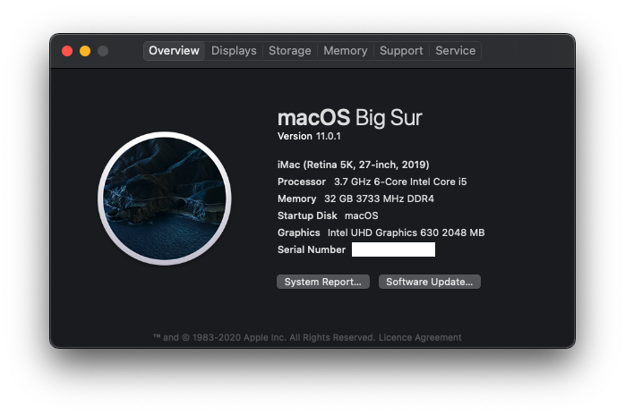

# Z390 Gigabyte Aorus Pro Wifi - OpenCore 0.6.3 - Big Sur 11.0.1 - 9600K - iGPU - hackintosh

Hackintosh EFI files for Z390 Aorus Pro Wifi. Other devs with this exact motherboard state that it will 'never be possible' to make the integrated WiFi & Blueooth work - well, they're wrong, it works perfectly fine using using zxystd's itlwm.
Feel free to download & use this as a helping point for your very own hackintosh build, but keep in mind:
  - If you aren't using iGPU, make all the neccessary changes for your dGPU
  - Remove the GPU_DISABLE SSDT (and inside config.plist) if you do not have a dedicated card that needs disabling in your system
  - Change the MLB, ROM, SystemSerialNumber and SerialUUID inside of config.plist
  - Make an OC snapshot if you are using different Kexts
  - You might want to add verbose for troubleshooting, at least until you get it to work as needed (-v into boot-args) 

## Information (and references)
### Specs
  - Z390 Aorus Pro Wifi
  - i5 9600K
  - UHD630 iGPU
  - RTX2060 (*Disabled & not used, using SSDT-GPU-DISABLE*)

### Credit / Useful links
  - [Dortania Install Guide - Intel Coffee Lake](https://dortania.github.io/OpenCore-Install-Guide/config.plist/coffee-lake.html#starting-point)
  - [zxystd's itlwm](https://github.com/OpenIntelWireless/itlwm)

## Functionality
### Working
  - [x] On-board WiFi & Bluetooth
  - [x] Hardware acceleration
  - [x] Sound - All inputs & outputs
  - [x] Shutdown & Restart
  - [x] USB map with correct speeds ~~(*see USBmap-explanation.md to see which ports I changed as some ports are disabled and some only run at USB3/2 since I do not need the other standard on those particular connections*)~~ (To be added)

### Unsure if works - will be tested & updated accordingly

### Not working
  - [ ] Sleep (works, but not reliably)
  

## Some hopefully useful tips for you
  - Changing the USB map? See [Port limit patch](https://github.com/corpnewt/USBMap#port-limit-patch) and [Dortania / USBMap - Intel mapping](https://dortania.github.io/OpenCore-Post-Install/usb/intel-mapping/intel.html)
  - Before upgrading the OpenCore, make sure to have a backup as I had immense difficulty with making 0.6.3 or 0.6.4 work (I failed). I will definitely have a shot at this soon and will keep this repo updated (**BigSur coming!!!**)
